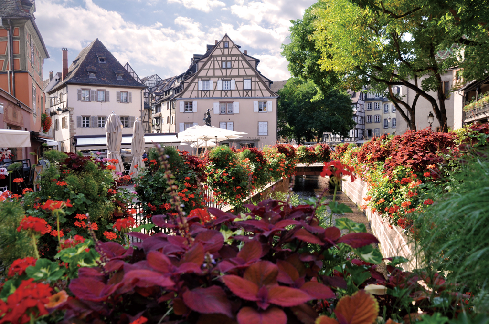

# コルマール Colmar

フランス東部、アルザス地域圏の都市コルマールは、ドイツとの国境も近く、かつてはドイツ領になったり、フランス領になったりと両国の間で揺れ動いてきた街です。幸いにも第二次世界大戦時に被害を奇跡的に免れたため、旧市街には中世〜ルネサンスにかけての街並みがよく保存されています。
特に、ドイツ文化の影響を色濃く受けた「コロンバージュ」と呼ばれる建物が特徴的です。これは木材で骨組みを作り、その間に石材やレンガなどで壁を作る構造の建物で、その外見はとてもかわいらしいものです。「フランスの花咲く町と村」にも認定されており、街中を流れる運河の欄干や家々の窓辺に飾られた美しい花々もまた魅力的です。
春〜夏にかけて、街中に花が咲き乱れる美しい光景を見にいくのもよいですが、コミックス第3巻（アニメ1期12羽）で登場したクリスマスマーケットで有名な街でもあるため、クリスマスにあわせて訪れても楽しめるでしょう。
またスタジオジブリの映画、ハウルの動く城のロケ地でもあり、冒頭に登場するシーンでは、コルマールの有名な観光名所であるプフィスタの家にそっくりな建物が登場します。

# 基本情報

* アルザス地域圏
* 人口	67,257人
* 面積	66.57km^2

# ACCESS

鉄道:パリからTGV（フランスの超特急）でストラスブールまで移動、所要時間2時間半〜3時間。ローカル線へ乗り継ぎ40分ほど。
フランクフルトからICE（ドイツの超特急）でオッフェンベルグまで移動、所要時間1時間40分。ローカル線に乗り継ぎ、ストラスブールを経由しコルマールへ1時間ほど。

## コルマールへのアクセス

### コルマール駅から旧市街へ

コルマール駅から旧市街へは1kmほど距離があります。
駅を出て左方向に進むと大きな公園にが右手に見え、そのまま進むとやがて木組みの家と石畳の街が見えてきます。
そこがコルマール旧市街です。迷ったときは、村の中心部という意味の "CENTRE VILLE" という看板にしたがうか、
コルマールの観光案内所である "Office de Tourisme" という看板にしたがって歩いていけば良いです。
コルマールの観光案内所は親切なスタッフの方がおり、英語が苦手な方でも街の案内や質問など気軽におこなっても大丈夫です。

◆ 観光案内所
Office de Tourisme de Colmar

🌍  https://www.tourisme-colmar.com/en/  
📍  Rue des Unterlinden, 68000 Colmar  
🏢  月〜土 9:00〜18:00  
   日     10:00〜13:00

## コルマールの歩き方

まずは、コルマールの街の中をゆっくりと走りながら解説してくれるプチトレインツアーに参加することをおすすめします。
日本語でのガイドもあり、コルマールの有名どころをきっちりと押さえたツアーになっています。
旧市街の観光案内所の近くにプチトレインツアーの集合場所があるので探してみましょう。

◆ プチトレインツアー
Le Petit Train de Colmar

🌍  http://www.petit-train-colmar.fr/en/  
📍  3 Rue Kléber, 68000 Colmar  
🏢  9:00〜18:00 (時期による)  
💶  € 7.00  

